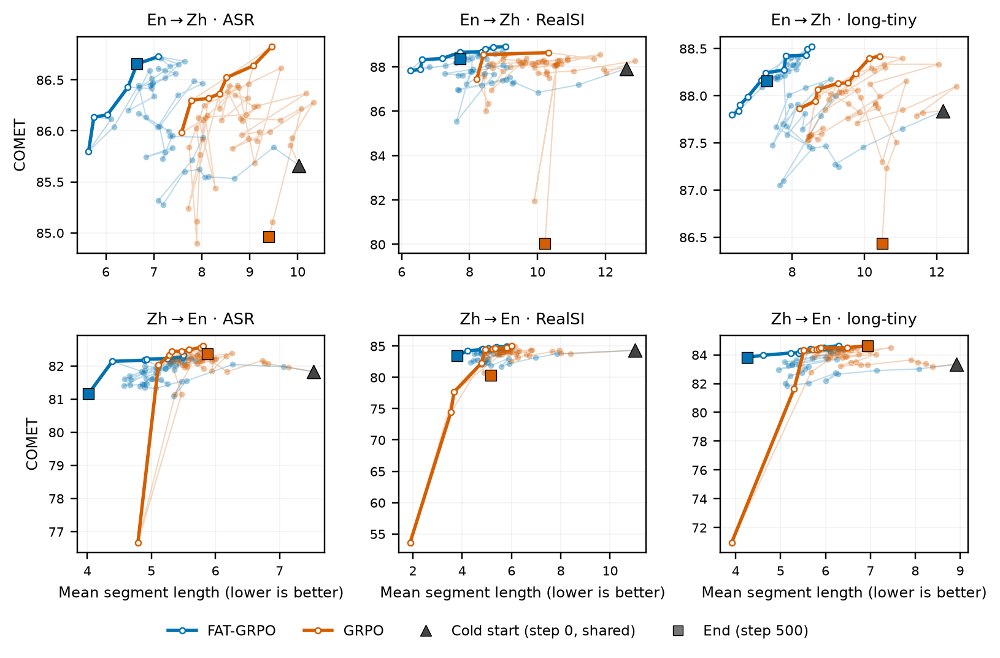

<div align="center">
    
    <h1>Confucius4-T3PO: simulTaneous Translation via pareTo Policy Optimization</h1>
</div>


<div align="center">
    <a href="./README_zh.md"></a>
    &nbsp;&nbsp;&nbsp;&nbsp;
    <a href="./LICENSE"></a>
    &nbsp;&nbsp;&nbsp;&nbsp;
    <a href="https://t3po.youdao.com"></a>
    &nbsp;&nbsp;&nbsp;&nbsp;
    <a href="https://github.com/netease-youdao/Confucius4-T3PO"></a>
    &nbsp;&nbsp;&nbsp;&nbsp;
    <a href="https://huggingface.co/netease-youdao/Confucius4-T3PO"></a>
    &nbsp;&nbsp;&nbsp;&nbsp;
    <a href="https://modelscope.cn/models/netease-youdao/Confucius4-T3PO"></a>
</div>


<br>

Confucius4-T3PO (simul**T**aneous **T**ranslation via pare**T**o **P**olicy **O**ptimization) is a **14-billion-parameter text-to-text simultaneous machine translation (SiMT) model** developed by the NetEase Youdao AI team. Its development follows a three-stage pipeline: high-quality segment-aligned data construction, streaming cold-start of the translation model, and Pareto-aware reinforcement learning for joint quality–latency optimization. It supports streaming text input and real-time `READ`/`WRITE` decisions. After receiving each fine-grained text chunk, the model dynamically decides whether to wait for further context or to immediately produce an incremental translation. Meanwhile, the model organizes the input sequence under an interleaved history protocol, enabling KV-cache reuse and reducing redundant computation overhead.

This model is a T2T (text-to-text) simultaneous translation model and does not natively support speech input. To translate speech, it can be cascaded with an external streaming automatic speech recognition (ASR) model, giving an S2T (speech-to-text) pipeline. We have also released [R2T2](https://huggingface.co/netease-youdao/Confucius4-R2T2), a streaming ASR model for simultaneous interpretation. In addition, we provide an [online demo](https://t3po.youdao.com), as well as a locally deployable Web UI and streaming client.

### Model Features

- **Fully streaming text translation:** supports fine-grained chunk input at the character and word level; committed translations are append-only and never rewritten. A stable prefix is preserved through the interleaved history, enabling KV-cache reuse and reducing redundant computation overhead.
- **Adjustable latency modes:** supports flexible switching across multiple quality–latency tiers, adapting to different simultaneous interpretation scenarios ranging from low-latency to high-quality.
- **Retained general instruction-following ability:** training does not degrade the general instruction-following ability of the Qwen base model, so further capabilities can be built on top of it, such as terminology constraints.
- **Cross-lingual generalization:** the model exhibits a degree of cross-lingual generalization. We observe that Chinese-to-Japanese, which was not trained, also supports streaming translation, though quality on directions other than Chinese and English has not been rigorously evaluated.

These capabilities come from two techniques we propose. The first is an algorithm that constructs high-quality segment-aligned data for simultaneous translation: it automatically derives low-latency streaming translation data from conventional parallel corpora, giving the model a well-adapted prior for its streaming cold start without relying on human interpretation corpora. The second is a reinforcement learning algorithm that optimizes the quality–latency frontier: for the competing objectives of quality and latency in simultaneous translation, we propose a frontier-aware reinforcement learning algorithm that measurably advances the Pareto frontier of the policy model. We will provide further details on the training method, data, and implementation in an upcoming technical report.

## Table of Contents

- [1 Evaluation Results](#1-evaluation-results)
- [2 Model Downloads](#2-model-downloads)
- [3 Quick Start](#3-quick-start)
- [4 Run the Local Web UI Demo](#4-run-the-local-web-ui-demo)
- [5 Citation](#5-citation)

## 1 Evaluation Results

We evaluate Confucius4-T3PO on several public benchmarks for Chinese-to-English and English-to-Chinese simultaneous translation. We compare it against the open-source models [InfiniSST](https://aclanthology.org/2025.findings-acl.157.pdf) and [EAST](https://aclanthology.org/2025.findings-acl.1045.pdf), as well as two major commercial simultaneous translation systems, A and B.


As shown below, compared with standard GRPO, our training method more effectively explores and improves the quality–latency Pareto frontier. It also avoids extremely low-latency regimes in which translation quality collapses, maintaining training stability.



## 2 Model Downloads

| **Model** | **Hugging Face** | **ModelScope** |
| :------: | :------------: | :----------: |
| Confucius4-T3PO | [🤗 Hugging Face](https://huggingface.co/netease-youdao/Confucius4-T3PO) | [ModelScope](https://modelscope.cn/models/netease-youdao/Confucius4-T3PO) |
| Confucius4-T3PO-GGUF | [🤗 Hugging Face](https://huggingface.co/netease-youdao/Confucius4-T3PO-GGUF) | [ModelScope](https://modelscope.cn/models/netease-youdao/Confucius4-T3PO-GGUF) |

## 3 Quick Start

### 3.1 Install Dependencies

```bash
python -m venv .venv && . .venv/bin/activate
pip install -e '.[models]'
```

### 3.2 Download the Model

```bash
# Hugging Face
hf download netease-youdao/Confucius4-T3PO \
  --local-dir ./Confucius4-T3PO

# ModelScope
pip install modelscope
modelscope download --model netease-youdao/Confucius4-T3PO \
  --local_dir ./Confucius4-T3PO
```

### 3.3 Serve the Model with vLLM

Start the inference server with vLLM:

```bash
vllm serve ./Confucius4-T3PO \
  --served-model-name Confucius4-T3PO \
  --dtype auto \
  --port 8010
```

Once the server is ready, check the available models:

```bash
curl http://127.0.0.1:8010/v1/models
```

Then configure this project to connect to the server:

```bash
cp .env.example .env

# Edit .env:
#   VLLM_BASE_URL=http://127.0.0.1:8010/v1
#   VLLM_MODEL=Confucius4-T3PO
```

Leave `TRANSLATION_BACKEND` at its default value, `auto`. When `VLLM_BASE_URL` is set, the project uses vLLM; otherwise, it falls back to loading the Hugging Face model weights in the current process.

> Authentication is disabled by default. Before exposing the server beyond the local machine, enable API-key authentication with `vllm serve --api-key <KEY>` and set `VLLM_API_KEY` to the same key in `.env`.

### 3.4 Inference Examples

Command-line usage (each line of standard input is a new source text chunk):

```bash
printf '大家\n好，\n今天\n我们\n测试\n流式\n翻译。\n' \
  | python -m inference.text_inference \
      --backend openai \
      --base-url http://127.0.0.1:8010/v1 \
      --model-id Confucius4-T3PO \
      --direction zh2en \
      --json-events
```

Python API:

```python
import asyncio

from inference.text_inference import StreamingTextTranslator


async def main() -> None:
    translator = StreamingTextTranslator(
        model_id="Confucius4-T3PO",  # Must match vLLM's --served-model-name
        direction="zh2en",
        backend="openai",
        base_url="http://127.0.0.1:8010/v1",
    )

    for chunk in ["这是", "一个", "流式", "翻译示例。"]:
        for event in await translator.feed(chunk):
            if event["type"] == "translation":
                print(event["text"], flush=True)

    # Translate any remaining buffered source text after the input ends.
    for event in await translator.flush():
        if event["type"] == "translation":
            print(event["text"], flush=True)


asyncio.run(main())
```

To load the model weights directly for a quick check or local debugging:

```bash
python -m inference.text_inference --model-id ./Confucius4-T3PO --direction zh2en --text '大家好。'
```

### 3.5 Latency Modes

The three quality–latency operating points from the evaluation results are selected with `--latency-mode` (`low` / `native` / `high`):

```bash
printf '这个\n方法的\n核心\n思想是\n' \
  | python -m inference.text_inference \
      --backend openai --base-url http://127.0.0.1:8010/v1 \
      --model-id Confucius4-T3PO --direction zh2en \
      --latency-mode native --json-events
```


## 4 Run the Local Web UI Demo

The interactive web demo is built with FastAPI and WebSocket and supports audio input from a microphone, a browser tab, or an audio file.

Use the `.env` file configured in [Section 3.3](#33-serve-the-model-with-vllm), with the same `VLLM_BASE_URL` and `VLLM_MODEL` settings:

```bash
bash scripts/start.sh
```

Open [http://127.0.0.1:8000/](http://127.0.0.1:8000/) in your browser to try the demo. If automatic speech recognition (ASR) is not configured, you can still use the text debugging panel to test translation.

### 4.1 Connect a Streaming ASR Service

Audio input is forwarded over WebSocket to the standalone [Confucius4-R2T2](https://huggingface.co/netease-youdao/Confucius4-R2T2) streaming ASR service. Refer to that repository for deployment instructions, then configure the connection in this project's `.env` file:

```bash
# .env
ASR_WS_URL=ws://127.0.0.1:8093/asr_stream_api_v1
ASR_SECRET_KEY=test0102
```

> In the currently released version of R2T2, the `secret_key` check uses a hard-coded development placeholder in `ws_server.py` (`secret_key_list=["test0102"]`). This is not exposed as a configuration option. Before deploying to production, modify the R2T2 source code to integrate a proper secret management system. Do not rely on this default value for access control.

Leaving `ASR_WS_URL` empty disables audio input. The text debugging panel remains available for testing translation.

When `ASR_LANGUAGE` is left empty, the recognition language is set to `Chinese` or `English` based on the session's `direction`. Set it to `zhen` to force R2T2's mixed Chinese–English recognition mode.

### 4.2 API Overview

- `GET /api/v1/health`: Health check.

- `POST /api/v1/translate`: Incremental text translation. The first request must include `direction`. The response contains a `session_id`; include this ID in subsequent requests to continue the same session. Set `end=true` to flush any remaining buffered text and release the session. The first request may also include `latency_mode` (`low` / `native` / `high`) to select a latency mode.

- `GET /api/v1/session/{session_id}/stats`: Retrieve segmentation statistics and `WAIT`/`TRANS` statistics for a session.

- `WS /ws/simul-demo`: Streaming speech translation. After the WebSocket handshake, send `{"type":"init","direction":"zh2en","latency_mode":"native"}` (`latency_mode` may be omitted). Wait for the server to respond with `init_ok`, then begin sending 16 kHz mono PCM16LE audio frames. During the session, send `{"type":"pause"}` or `{"type":"resume"}` to pause or resume streaming. Send `{"type":"end"}` to end the session and flush any remaining buffered text.

Server-to-client events include `init_ok`, `loading` (`component` is either `translation` or `asr`), `asr` (`text` contains the new text chunk forwarded from R2T2; when `reset` is true, recognition of a sentence is complete and a translation flush is triggered), `translation`, `metrics`, `pause_ok`, `resume_ok`, `ended`, and `error`. For complete field definitions, see [`inference/server.py`](inference/server.py) and [`inference/asr.py`](inference/asr.py).

## 5 Citation

Formal citation information will be added when the technical report is released.

```bibtex
@misc{Confucius4-T3PO,
  author = {NetEase Youdao Team},
  title = {Confucius4-T3PO: simulTaneous Translation via pareTo Policy Optimization},
  url = {},
  month = {Sep},
  year = {2026}
}
```
